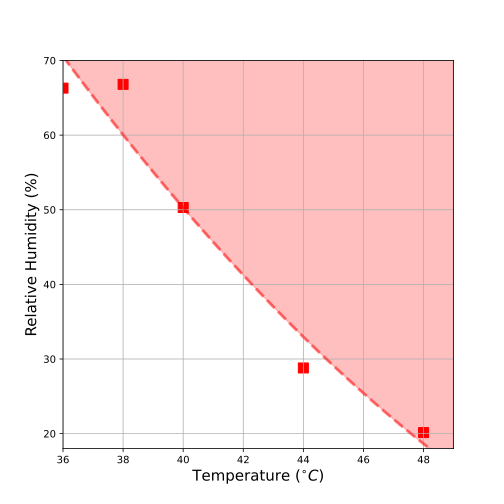

[](https://zenodo.org/badge/latestdoi/542107849)

# Lethal Heat: Identifying lethal temperature and humidity
High temperature and humidity can have significant health impacts on the human body. In some cases, this can be lethal.
This repository contains a small Python package for calculating lethal levels of heat from temperature and relative humidity.
Example scripts for using this functionality with CMIP6 or ERA5 data are included in scripts.
The methodology is described in [(Powis et al., 2023)](https://www.science.org/doi/10.1126/sciadv.adg9297) and based on
experimental evidence by [(Vecellio et al., 2022)](https://pubmed.ncbi.nlm.nih.gov/34913738/).




## Installation
Clone this repository to somewhere you like.

In your terminal, cd into the directory. Enter:

```
pip install .
```

## Example Useage

This package just contains one object: Vecellio22(). It can be used for
determining lethal heat according to the 2022 Vecellio study.
It works by interpolating the data in that paper into a smooth curve.
Then, it takes temperature, humidity pairs and returns a boolean, or 
array of booleans.

### Basics
Import lethal_heat:

```
from lethal_heat import Vecellio22
```

Create Vecellio22 object. By default, it will interpolate using numpy.polyfit with degree 1. You can provide a different degree.
```
v22 = Vecellio22(degree=1)
```

Test if a set of temperatures and relative humidities are lethal. This will return an array of booleans. True = Lethal.
```
temperature = [35, 40, 41, 45]
rel_humidity = [60, 70, 80, 90]
v22.isLethal(temperature, rel_humidity)
```


Plot lethal region with temperature, humidity pairs on a plot with the lethal region shaded. You can also just plot the lethal region.
```
v22.plot( tdb = temperature, rh = rel_humidity)
```

### Applying to large datasets

If you have data in netcdf, geotiff or zarr, you can calculate lethal heat lazily, in parallel and in chunks using something like:
```
temperature = xr.open_dataset(filename_temp, chunks={'time':10})
rel_humidity = xr.open_dataset(filename_rh, chunks={'time',:10})

uncomputed = v22.map_to_data(temperature, rel_humidity)
uncomputed.to_netcdf(fp_out)
```

Or alternatively, you can do it straight from file (netcdf only)
```
Vecellio22.calculate_from_files( fp_temperature, 
                                 fp_humidity, fp_out,
                                 chunks = {'time':100})
```

### Creating and applying a lookup table
It is often the case with climate data that you do not have hourly data available for analysis. If you have daily maxima, we can apply the analysis assuming that temperature and relative humidity are both sinusoids of opposite phase for each day of data. We can make this analysis even quicker by creating a lookup table that estimates how many hours of lethal heat there will be on any given day from the mean temperature and relative humidity and their daily amplitudes (half the range).

```
# Create a lookup table
lookup = v22.create_lookup_table( np.arange(20,60,1), np.arange(20,100,1), 
                                  np.arange(0,20,1), np.arange(0,20,1),)
```

This will create an xarray dataset with 4 dimensions, which can be quickly indexed to obtain an estimate of lethal heat hours. In this case, the resolution of each dimension is 1 degree or % of relative humidity. The finer this gets, the more accurate the lookup technique will be, but required memory will increase quickly.

We can easily index the lookup table for a set of values as follows:

```
lethal_heat_hours = v22.lethal_heat_hours_from_lookup( lookup, tmean, rmean, tamp, ramp )
```

Here, `tmean`, `rmean`, `tamp` and `ramp` may be multidimensional arrays.
